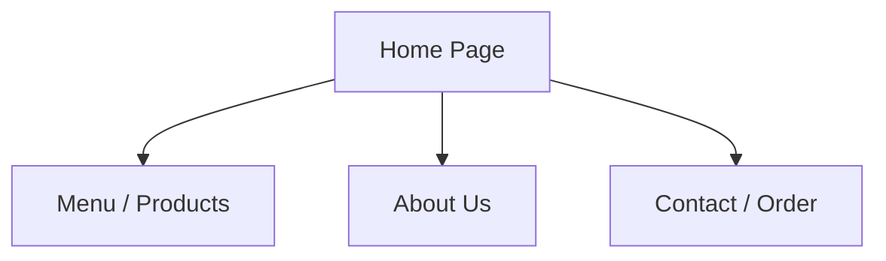
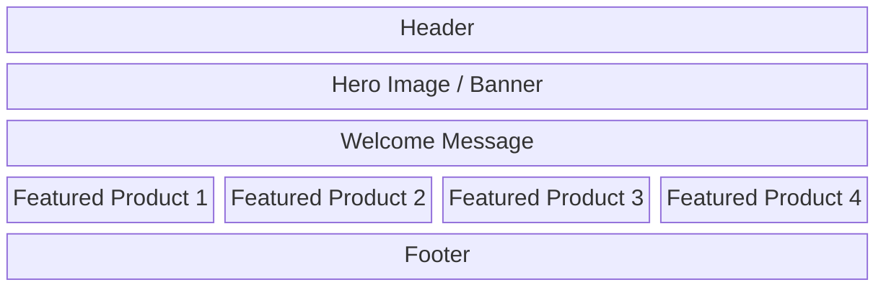
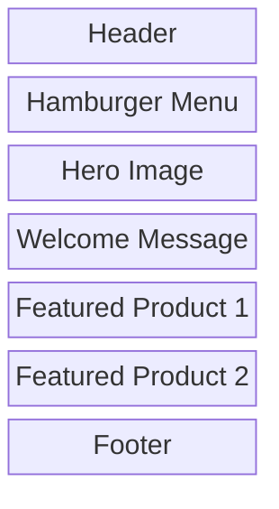

# COVER PAGE
**Project Title**: Crust & Crumb Bakery - Business Process & Website Initiation
**Course**: Web Development
**Group Members**: [Insert Names]
**Submission Date**: Friday April 03, 2026

---

# PROJECT BACKGROUND
**Domain Chosen**: A local artisanal bakery named "Crust & Crumb Bakery."
**Business Processes**: The bakery currently relies heavily on foot traffic and phone orders for its artisanal breads and pastries. The ordering process is manual, which often leads to errors and limits their reach beyond the local neighborhood.
**Why a Website is Needed**: A website is crucial to showcase their products, allow customers to place pre-orders online, provide location and contact information, and share their story. This will increase visibility, streamline the ordering process, and build an online community, expanding their business reach.

---

# SITE MAP

---

# WIREFRAME

## Desktop View 

## Mobile View

